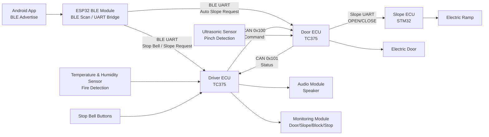

# Bluetooth 기반 교통약자용 버스 출입 통합 제어 시스템 (Smart Bus Access)

Bluetooth Low Energy, CAN, UART, 다중 MCU 제어를 연동하여
교통약자의 버스 승하차를 자동화하고 전동문/전동경사로/안전 센서/모니터링을 통합한 임베디드 시스템

---

## 팀원

<div align="center">
<table>
  <tr>
    <td align="center">
      <a href="https://github.com/jeongjeson656">
        
        <br />
        <b>SON JEONG JE</b>
      </a>
      <br />
      팀장
      <br />
      메인 ECU 제어 로직
      <br />
      하차벨 / 끼임방지 기능
    </td>
    <td align="center">
      <a href="https://github.com/starryeev">
        
        <br />
        <b>김건우</b>
      </a>
      <br />
      팀원
      <br />
      협업툴 & 산출물 관리
      <br />
      오디오 / 모니터링 / 화재감지
    </td>
    <td align="center">
      <a href="https://github.com/hannah0227">
        
        <br />
        <b>장혜나</b>
      </a>
      <br />
      팀원
      <br />
      하드웨어 설계
      <br />
      전동문 / 전동경사로 제어 모듈
    </td>
    <td align="center">
      <a href="https://github.com/an0520a">
        
        <br />
        <b>안○○</b>
      </a>
      <br />
      팀원
      <br />
      CAN / Bluetooth 모듈
      <br />
      사용자 App / 전동문 ECU 제어
    </td>
  </tr>
</table>
</div>

---

## 기술 스택

<div align="center">

### 하드웨어

<p>
  
  
  
  
  
</p>

### 기술스택

<p>
  
  
  
  
  
  
  
  
  
  
</p>

### 협업 & 도구

<p>
  
  
  
  
  
  
  
</p>

</div>

---

## 1. 프로젝트 소개

`Smart Bus Access`는 교통약자, 특히 휠체어 이용자의 버스 승하차를 더 안전하고
편리하게 지원하기 위한 Bluetooth 기반 버스 출입 통합 제어 시스템입니다.

스마트폰 앱은 BLE 광고 신호로 승차 또는 하차 요청을 전송하고, ESP32 BLE 모듈은
해당 신호를 감지해 TC375 ECU로 UART 명령을 전달합니다. 운전석 ECU와 전동문 ECU는
CAN 통신으로 전동문과 전동경사로 제어 명령 및 상태를 주고받으며, 전동문 ECU는
전동문 구동부와 STM32 기반 전동경사로 제어부를 연동합니다.

<table>
  <tr>
    <td>
      핵심 흐름은 <strong>BLE 사용자 신호 감지 → UART 명령 변환 →
      운전석 ECU 판단 → CAN command/status 교환 → 전동문 및 전동경사로 제어 →
      모니터링/오디오 피드백</strong>입니다.
      <br /><br />
      여기에 초음파 센서 기반 끼임방지, Temperature & Humidity Sensor 기반 화재감지, 하차벨, 실시간
      상태 모니터링, 음성 안내를 함께 구성하여 버스 출입 장치의 편의성과
      안전성을 통합적으로 다룹니다.
    </td>
  </tr>
</table>

## 2. 프로젝트 목표

- IoT(Bluetooth) 기반 버스 전동문 제어 및 사용자 연동 시스템 구현
- 운전석 ECU와 전동문 ECU 사이의 CAN 통신을 활용한 안정적인 장치 간 제어 구조 구현
- Android App, ESP32 BLE 모듈, TC375, STM32를 연결한 다중 MCU 임베디드 시스템 구성
- 교통약자 여부에 따라 전동경사로를 자동 전개하는 사용자 맞춤형 승하차 지원 기능 구현
- 초음파 센서와 온습도 센서를 활용한 끼임방지 및 화재감지 안전 로직 구현
- 전동문, 전동경사로, 끼임감지, 하차벨 상태를 실시간 표시하는 모니터링 기능 구현
- 요구사항 정의, 인터페이스 설계, 통합 테스트, 시나리오 테스트를 포함한 V-Model 기반 산출물 작성

## 3. 주요 기능

| 기능 | 내용 |
| --- | --- |
| **BLE 기반 교통약자 접근 인식** | Android 앱이 BLE Manufacturer Data를 광고하고, ESP32 모듈이 RSSI 조건을 만족하는 신호를 감지합니다.<br />감지된 승차/하차/슬로프 요청은 UART 명령으로 변환되어 ECU 제어 흐름으로 전달됩니다. |
| **승하차 상황 연계 자동 제어** | 장애인용 하차벨 또는 승차 슬로프 요청이 활성화된 상태에서 전동문 개방 명령이 발생하면 전동경사로를 함께 전개합니다.<br />전동문 폐쇄 흐름에서는 전동경사로 수납 및 하차벨 초기화와 연계됩니다. |
| **운전석 ECU 제어 로직** | 하차벨, 장애인 하차벨, 전동문 버튼, 전동경사로 버튼, BLE UART 명령, 화재감지 상태를 통합 판단합니다.<br />Door ECU로 CAN command를 송신하고 Door/Slope/Block/Stop 상태를 모니터링 모듈과 오디오 안내로 피드백합니다. |
| **전동문 ECU 제어 로직** | CAN command를 수신해 전동문 열림/닫힘과 전동경사로 전개/수납 요청을 처리합니다.<br />초음파 센서로 끼임을 감지하면 닫힘 동작을 제한하거나 다시 개방하고, 상태를 CAN status로 운전석 ECU에 반환합니다. |
| **CAN 통신 프로토콜** | 운전석 ECU → 전동문 ECU command는 CAN ID `0x100`, 전동문 ECU → 운전석 ECU status는 CAN ID `0x101`을 사용합니다.<br />1바이트 payload 안에 door command, ramp command, 수동/자동 플래그, fault/reset, door/ramp state, alive 정보를 비트 단위로 패킹합니다. |
| **UART 신뢰성 프레임** | BLE UART와 Slope UART는 6바이트 고정 프레임을 사용합니다.<br />`0xA5 0x5A` SOF, DATA/ACK 타입, `seq`, `cmd`, 프레임 검증, ACK timeout, retry limit, 중복 프레임 억제 구조를 갖습니다. |
| **전동문 및 전동경사로 구동** | 전동문은 TC375 CCU6 PWM 기반으로 duty를 점진적으로 변경하며 열림/닫힘을 수행합니다.<br />전동경사로는 STM32 HAL 기반 구동 시퀀스를 통해 전개/수납 동작을 수행합니다. |
| **안전 및 안내 기능** | 초음파 센서는 약 30cm 이내 장애물을 감지해 끼임방지 상태를 생성합니다.<br />Temperature & Humidity Sensor 기반 화재감지 시 화재 안내 음성을 재생하고 전동문 개방 명령을 발생시킵니다. 오디오 모듈은 문 열림/닫힘, 경사로 전개/수납, 화재 경보 음원을 재생합니다. |
| **실시간 모니터링** | 모니터링 모듈에 Door, Slope, Block, Stop 상태를 비트마스킹 기반으로 표시합니다.<br />운전자는 전동문, 전동경사로, 끼임감지, 하차벨 상태를 즉시 확인할 수 있습니다. |

## 4. 시스템 소개

전체 시스템은 Android App, ESP32 BLE 모듈, 운전석 ECU, 전동문 ECU, 전동경사로 ECU,
센서 및 액추에이터 모듈로 구성됩니다.

Android App은 사용자가 버튼을 누르면 60초 동안 BLE 광고를 송신합니다. ESP32 모듈은
BLE 신호의 company id, command code, active flag, RSSI를 확인한 뒤 ECU가 이해할 수
있는 UART 프레임으로 변환합니다.

운전석 ECU는 하차벨, BLE 요청, 전동문/경사로 버튼, 화재감지 결과를 모아 CAN command를
생성합니다. 또한 전동문 ECU에서 돌아오는 status를 polling하여 전동문, 경사로,
끼임감지 상태를 업데이트하고 모니터링 및 오디오 모듈에 반영합니다.

전동문 ECU는 CAN command를 받아 전동문 구동부를 제어하고, 경사로 요청은 Slope UART를
통해 STM32 전동경사로 ECU로 전달합니다. 장애물 감지 중에는 전동문 닫힘을 막고, 닫히는
중 장애물이 감지되면 다시 열림 동작으로 전환합니다.

<p align="center">
  
</p>



### 레포지토리 구조

```text
smart-bus-access
├── docs
│   ├── 프로젝트 개요서
│   ├── 최종 결과보고서
│   ├── 요구사항 & 테스트케이스 문서
│   └── 인터페이스 & 모듈 설계서
└── src
    ├── app
    │   └── Android BLE 광고 앱
    ├── bluetooth-module
    │   └── ESP32 BLE 스캔 및 UART 브리지
    ├── driver-ecu
    │   └── 운전석 TC375 ECU 제어 코드
    ├── door-ecu
    │   └── 전동문 TC375 ECU 제어 코드
    └── slope-ecu
        └── STM32 전동경사로 제어 코드
```

## 5. 프로젝트 의의

이 프로젝트는 버스 전동문과 전동경사로를 단순히 개별 장치로 제어하는 데서 끝나지 않고,
BLE 사용자 인식, ECU 간 CAN 통신, UART 기반 보조 MCU 연동, 안전 센서, 모니터링,
오디오 안내를 하나의 승하차 서비스 흐름으로 연결했다는 점에 의미가 있습니다.

특히 교통약자 여부를 운전자가 매번 직접 판단하지 않아도 시스템이 승차 또는 하차 상황을
인식하고 전동경사로를 연동하도록 설계했습니다. 이를 통해 교통약자의 대중교통 접근성을
높이고, 운전자의 부담을 줄이며, 끼임방지와 화재감지로 승객 안전까지 함께 고려했습니다.

또한 1바이트 CAN payload 설계, UART DATA/ACK 프레임, polling 중심의
임베디드 제어 구조를 직접 구현하여 제한된 MCU 환경에서 여러 보드와 모듈을 통합하는
경험을 담았습니다.
